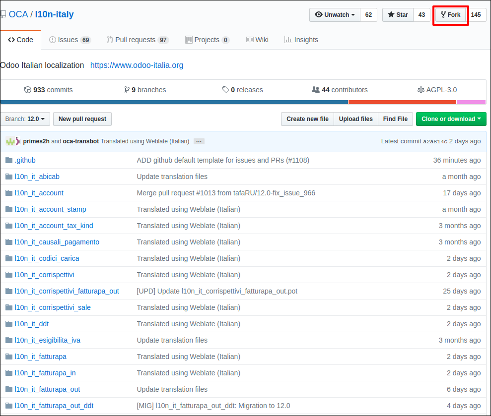
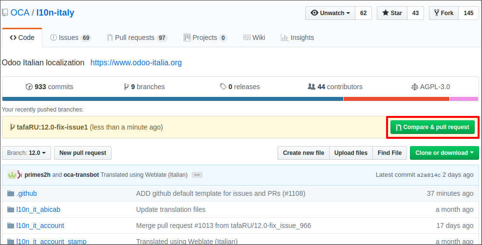
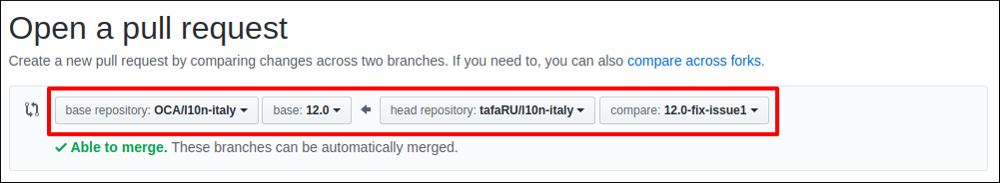
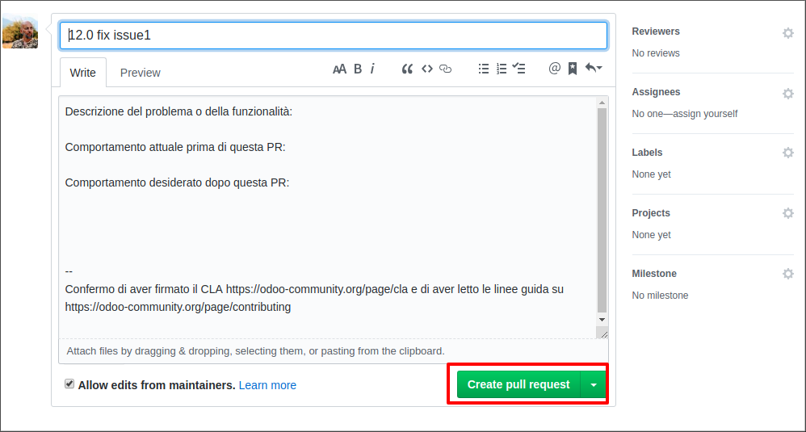

==========================
Come contribuire su GitHub
==========================

I principali strumenti messi a disposizione da GitHub per contribuire sono:

* Pull Request (PR)
* Issue

Una PR è il modo per comunicare che abbiamo apportato (o abbiamo iniziato a lavorare su) delle modifiche che vorremmo
venissero incluse nel progetto.
Le issue vengono utilizzate per `segnalare task, bug o feature di un progetto <https://help.github.com/en/articles/managing-your-work-with-issues>`_.

Prima di creare una nuova PR o issue controllare sempre se ci sono segnalazioni su ciò che si vuole modificare,
così da evitare di sovrapporsi ad altre PR e di includere eventuali issue.

Supponi ad esempio di aver scovato un bug in uno dei moduli italiani e di voler proporre una correzione.

I passaggi chiave sono:

#. `Operazioni preliminari`_.
#. `Fork del repository`_.
#. `Creare un branch`_.
#. `Creare una PR`_.
#. `Far accettare la PR`_.

----------------------
Operazioni preliminari
----------------------

Una volta creato il tuo account su `GitHub <https://github.com>`_ ti consigliamo di aggiungere
la tua chiave pubblica SSH in modo da non dover inserire ogni volta le tue credenziali. Per farlo puoi seguire questa
`guida <https://help.github.com/en/articles/connecting-to-github-with-ssh>`_.

Firma la `CLA <https://odoo-community.org/page/cla>`_ altrimenti i tuoi contribuiti non verranno accettati.

-------------------
Fork del repository
-------------------
Apri il `repository dei moduli italiani di Odoo <https://github.com/OCA/l10n-italy>`_ e premi il tasto **Fork**:

Clona il repository in locale::

    git clone git@github.com:OCA/l10n-italy.git

----------------
Creare un branch
----------------
Non lavorare mai sulla copia (clone del fork), è preferibile farlo su un branch parallelo.
Per creare un branch::

    cd l10n-italy
    git checkout -b mio_branch

Il nome del branch dovrebbe avere come prefisso sempre il numero della versione Odoo per poterli identificare più facilmente.

Esempio::

    git checkout -b 12.0-fix-issue1

Scrivi le modifiche e aggiungile al tuo branch::

    git add -p
    git commit -m "Close issue #1"

Un messaggio di commit scritto bene agevola sia il processo di review sia la consultazione del log dei commit.

Assicurati che le tue modifiche siano compatibili con le `linee guida <https://github.com/OCA/odoo-community.org/blob/master/website/Contribution/CONTRIBUTING.rst>`_
di `OCA <https://odoo-community.org/>`_
Per farlo puoi utilizzare i seguenti strumenti:

* `Pylint Odoo <https://pypi.org/project/pylint-odoo/>`_
* `Flake8 <https://pypi.org/project/flake8/>`_
* `Template di un modulo Odoo <https://github.com/OCA/maintainer-tools/tree/master/template/module>`_

-------------
Creare una PR
-------------
Carica le modifiche sul tuo fork::

    git remote add mio_remote git@github.com:mio_remote/l10n-italy.git
    git push mio_remote 12.0-fix-issue1

dove *mio_remote* corrisponde al nome del tuo account GitHub.

Es::

    git remote add tafaRU git@github.com:tafaRU/l10n-italy.git
    git push tafaRU 12.0-fix-issue1

Per aprire la PR premere il tasto **Compare & pull request**:

Prima di crearla verifica la corrispondenza dei seguenti dati:

* base repository: OCA/l10n-italy
* base: versione di Odoo
* head repository: mio_remote/l10n-italy
* compare: tuo branch

A questo punto la puoi creare premendo il tasto **Create pull request**:

--------------------
Far accettare la PR
--------------------
Alla creazione della PR vengono avviati automaticamente i seguenti strumenti:

* CLA BOT per verificare la stato della tua `CLA <https://odoo-community.org/page/cla>`_
* Travis che si occupa di creare una nuova build del progetto, eseguire i test e segnalarne il risultato
* Coveralls per determinare quale percentuale del codice è coperta dai test.
* `Runbot <https://runbot.odoo-community.org/runbot>`_ che crea una nuova build di Odoo su cui è possibile effettuare
  i test funzionali

Ora che la PR è stata creata inizia il processo di review (:doc:`come fare una revisione <review>`),
una vera e propria conversazione in stile social, in cui potrai discutere insieme ai vari reviewer.

Assicurati che il risultato di tutti i controlli sia positivo e tieniti pronto ad applicare le correzioni suggerite.

L'accettazione della PR e quindi il suo merge dipende esclusivamente dal
`numero delle approvazioni ricevute <https://github.com/OCA/odoo-community.org/blob/master/website/Contribution/oca_module_lifecycle_development_status.rst>`_.

