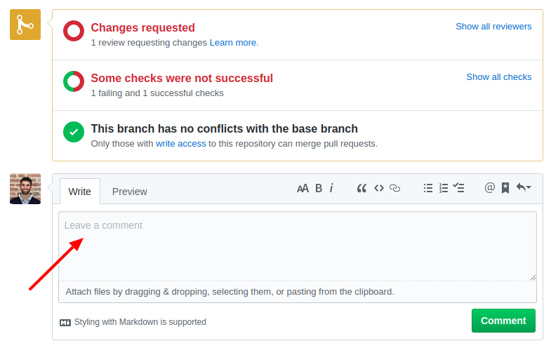
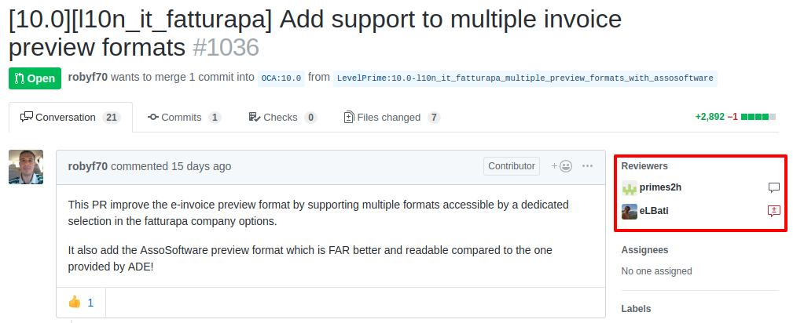
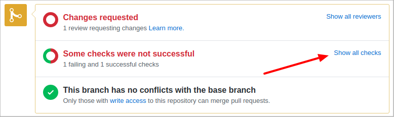
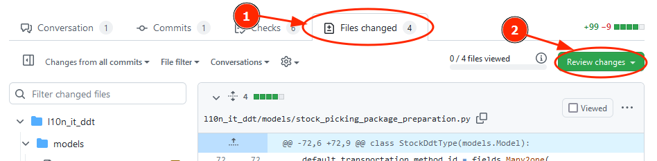
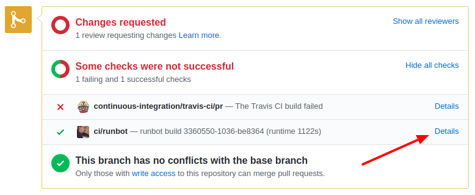
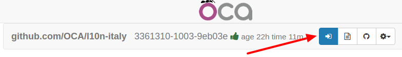
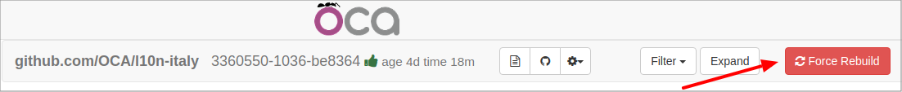

=======================
Come fare una revisione
=======================

Questa guida è basata su https://odoo-community.org/page/review e spiega i passi per fare una revisione tecnica delle modifiche proposte (PR o Pull Request) nel repository Italiano https://github.com/OCA/l10n-italy.

I passaggi chiave sono:

#. Creare o accedere al proprio profilo Github -> `Profilo Github`_.
#. Scegliere le modifiche da revisionare -> `Scelta della PR`_.
#. Fare la revisione tecnica -> `Revisione tecnica`_.

Profilo Github
==============

Un profilo Github è necessario sia per proporre che per revisionare modifiche.

Se devi creare un profilo vai su https://www.github.com e clicca su **Sign up**

.. image:: ./immagini/github_login.png

quindi segui le istruzioni per creare un nuovo profilo.

Scelta della PR
===============

La lista di tutte le PR aperte è https://github.com/OCA/l10n-italy/pulls.

Le PR pronte per essere verificate sono identificate dalla label **needs review**.

.. image:: ./immagini/github_prs_list.png

Dal titolo della PR è possibile capire l'ambito delle modifiche proposte.

Revisione tecnica
=================

Prima di tutto è necessario capire cosa vuole ottenere chi ha creato la PR, quindi leggi la descrizione.
Se ci sono aspetti non chiari, puoi chiedere allo sviluppatore che ha implementato le modifche aggiungendo un commento alla PR

Notare il numero di revisori già presenti:

in generale non sono necessari più di tre revisori, il numero di approvazioni necessarie è fissato nelle linee guida OCA: https://odoo-community.org/page/module-maturity-levels.

Esistono alcune procedure automatiche che fanno una prima verifica del codice, queste sono visibili in fondo alla PR espandendo **Show all checks**

Se le procedure automatiche non hanno rilevato errori, procedere alle verifiche manuali.

Verifica tecnica
-------------------

Per fare una revisione del codice è necessario un buon livello di conoscenza di Python e Odoo.

Accedere al tab **Files changed**

Verificare la correttezza dei cambiamenti proposti e la loro coerenza con le `linee guida OCA <https://github.com/OCA/odoo-community.org/blob/master/website/Contribution/CONTRIBUTING.rst>`_.

Verifica funzionale
-------------------

Per fare una revisione funzionale è sufficiente aprire la procedura automatica **ci/runbot**

Se è presente il pulsante blu

vuol dire che un'istanza Odoo contenente le modifiche è pronta per eseguire i test, le credenziali da amministratore per accedere sono:

* Email: "admin"
* Password: "admin"

Se il pulsante blu non è presente (le istanze possono essere spente per limitare il consumo di risorse), cliccare **Force Rebuild**

e attendere che il pulsante blu torni visibile.
