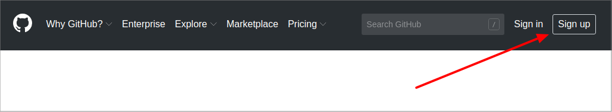
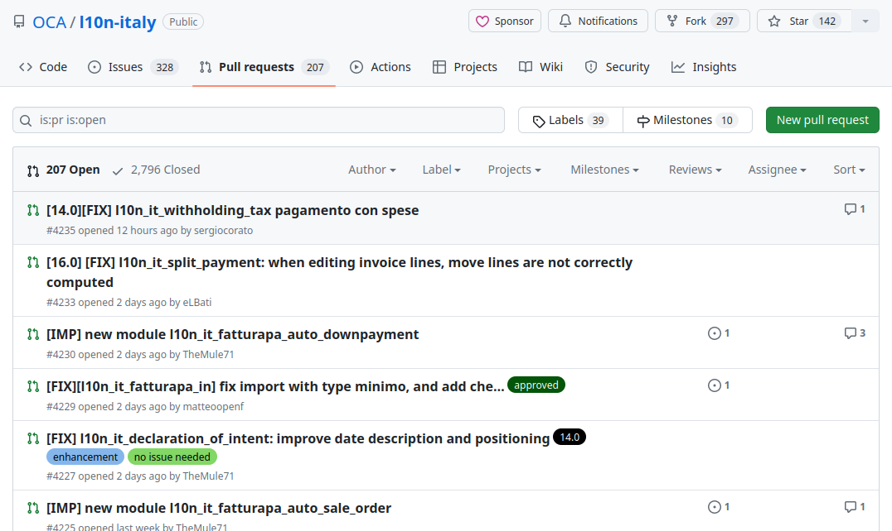

=======================
Come fare una revisione
=======================

Questa guida spiega i passaggi chiave per fare una revisione tecnica delle modifiche proposte (PR o Pull Request) nel repository Italiano https://github.com/OCA/l10n-italy.

.. contents::

Profilo Github
==============

Un profilo Github è necessario sia per proporre che per revisionare modifiche.

Se devi creare un profilo vai su https://www.github.com e clicca su **Sign up**

quindi segui le istruzioni per creare un nuovo profilo.

Scelta della PR
===============

La lista di tutte le PR aperte è https://github.com/OCA/l10n-italy/pulls.

Le PR pronte per essere verificate sono identificate dalla label **needs review**.

Dal titolo della PR è possibile capire l'ambito delle modifiche contenute.

Revisione tecnica
=================

Prima di tutto bisogna capire cosa vuole ottenere chi ha creato la PR, quindi leggi la descrizione.
Se ci sono aspetti non chiari, chiedi chiarimenti allo sviluppatore.

#. Prova le modifiche

   * In fondo alla pagina, trovi il risultato dei vari bot di CI/CD, qui troverai anche un'istanza pronta per eseguire i test