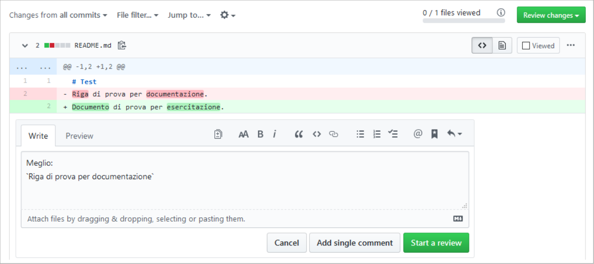

=======================
Come fare una revisione
=======================

Questa guida è basata su https://odoo-community.org/page/review e spiega i passi per fare una revisione tecnica delle modifiche proposte (PR o Pull Request) nel repository Italiano https://github.com/OCA/l10n-italy.

I passaggi chiave sono:

#. Creare o accedere al proprio profilo Github -> `Profilo Github`_.
#. Scegliere le modifiche da revisionare -> `Scelta della PR`_.
#. Effettuare la revisione -> `Revisione`_ tecnica o funzionale.

Profilo Github
==============

Un profilo Github è necessario sia per proporre che per revisionare modifiche.

Per creare un profilo andare su https://www.github.com e fare clic su **Sign up**

.. image:: ./immagini/github_login.png

quindi seguire le istruzioni per creare un nuovo profilo.

Scelta della PR
===============

La lista di tutte le PR aperte è https://github.com/OCA/l10n-italy/pulls.

Le PR pronte per essere verificate sono identificate dalla label **needs review**.

.. image:: ./immagini/github_prs_list.png

Dal titolo della PR è possibile capire l'ambito delle modifiche proposte.

Revisione
=========

Prima di tutto è necessario capire cosa vuole ottenere chi ha creato la PR, quindi leggi la descrizione.
Se ci sono aspetti non chiari, è possibile chiedere allo sviluppatore che ha implementato le modifiche aggiungendo un commento alla PR

.. image:: ./immagini/github_pr_comment.png

Notare il numero di revisori già presenti:

.. image:: ./immagini/github_pr_reviewers.png

in generale non sono necessari più di tre revisori, il numero di approvazioni necessarie è fissato nelle linee guida OCA: https://odoo-community.org/page/module-maturity-levels.

Esistono alcune procedure automatiche che fanno una prima verifica del codice, queste sono visibili in fondo alla PR espandendo **Show all checks**

.. image:: ./immagini/github_pr_show_checks.png

Se le procedure automatiche non hanno rilevato errori, procedere alle verifiche manuali.

Revisione tecnica
-----------------

Per fare una revisione del codice è necessario un buon livello di conoscenza di Python e Odoo.

Accedere al tab **Files changed**

Vengono visualizzate le parti di codice che sono state modificate

Verificare la correttezza dei cambiamenti proposti e la loro coerenza con le `linee guida OCA <https://github.com/OCA/odoo-community.org/blob/master/website/Contribution/CONTRIBUTING.rst>`_ e le :doc:`linee guida Italiane <guidelines>`.

Controllare che le stringhe utilizzate per i menu e i nomi dei campi nel sorgente siano coerenti con le stringhe utilizzate nel README.

Per suggerire delle modifiche fare clic sul simbolo ‘+’ a sinistra della riga

.. image:: ./immagini/github_pr_review_r3.png

Nella finestra che si apre inserire commenti e/o codice suggerito.

Completato il commento fare clic su **Start a review**.

Il pulsante in alto a destra cambierà in **Finish your review 1**. 

Procedere con eventuali altri commenti.
Inseriti tutti i commenti fare clic su **Finish your review N** dove N è il numero di commenti inseriti.

.. image:: ./immagini/github_pr_review_r1.png

La maschera che si apre consente di inserire un messaggio e il tipo di azione da eseguire tra **Comment** (per lasciare un semplice commento), **Approve** (per approvare le modifiche proposte dalla PR), **Request changes** (per richiedere delle variazioni alle modifiche proposte).
Per confermare la revisione fare clic su **Submit review**.

Revisione funzionale
--------------------

Per fare una revisione funzionale è sufficiente aprire la procedura automatica **ci/runbot**

.. image:: ./immagini/github_pr_show_runbot.png

Se è presente il pulsante blu

.. image:: ./immagini/runbot_build_online.png

vuol dire che un'istanza Odoo contenente le modifiche è pronta per eseguire i test, le credenziali da amministratore per accedere sono:

* Email: "admin"
* Password: "admin"

Se il pulsante blu non è presente (le istanze possono essere spente per limitare il consumo di risorse), fare clic su **Force Rebuild**

.. image:: ./immagini/runbot_force_rebuild.png

e attendere che il pulsante blu torni visibile.
