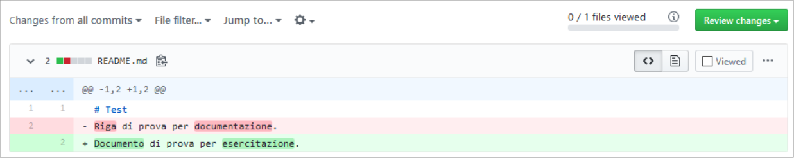
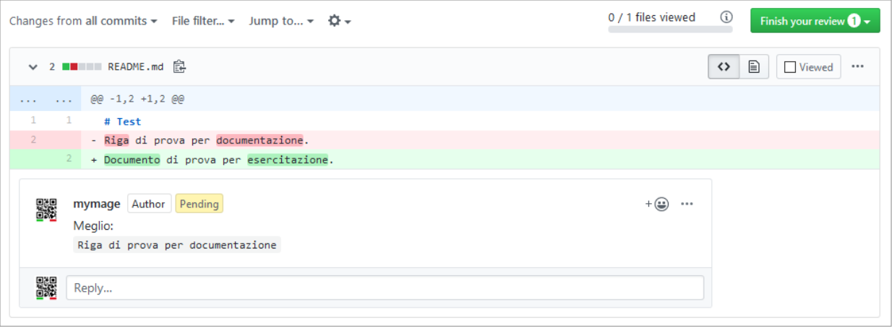

=======================
Come fare una revisione
=======================

Questa guida è basata su https://odoo-community.org/page/review e spiega i passi per fare una revisione tecnica delle modifiche proposte (PR o Pull Request) nel repository Italiano https://github.com/OCA/l10n-italy.

I passaggi chiave sono:

#. Creare o accedere al proprio profilo Github -> `Profilo Github`_.
#. Scegliere le modifiche da revisionare -> `Scelta della PR`_.
#. Effettuare la revisione -> `Revisione`_ tecnica o funzionale.

Profilo Github
==============

Un profilo Github è necessario sia per proporre che per revisionare modifiche.

Per creare un profilo andare su https://www.github.com e fare clic su **Sign up**.

.. image:: ./immagini/github_login.png
   :align: center

quindi seguire le istruzioni per creare un nuovo profilo.

Scelta della PR
===============

La lista di tutte le PR aperte è https://github.com/OCA/l10n-italy/pulls.

Dal titolo della PR e dalle etichette assegnate (**labels**) è possibile capire la tipologia, l'ambito e lo stato delle modifiche proposte.

Revisione
=========

Prima di tutto è necessario capire cosa vuole ottenere chi ha creato la PR, quindi leggi la descrizione.
Se ci sono aspetti non chiari, è possibile chiedere allo sviluppatore che ha implementato le modifiche aggiungendo un commento alla PR.

.. image:: ./immagini/github_pr_comment.png
   :align: center

Notare il numero di revisori già presenti:

.. image:: ./immagini/github_pr_reviewers.png
   :align: center

in generale non sono necessari più di tre revisori, il numero di approvazioni necessarie è fissato nelle linee guida OCA: https://odoo-community.org/page/module-maturity-levels.

Esistono alcune procedure automatiche che fanno una prima verifica del codice, queste sono visibili in fondo alla PR espandendo **Show all checks**.

.. image:: ./immagini/github_pr_show_checks.png
   :align: center

Se le procedure automatiche non hanno rilevato errori, procedere alle verifiche manuali.

Revisione tecnica
-----------------

Per fare una revisione del codice è necessario un buon livello di conoscenza di Python e Odoo.

Accedere alla scheda **Files changed**.

Vengono visualizzate le parti di codice che sono state modificate.

Verificare la correttezza dei cambiamenti proposti e la loro coerenza con le `linee guida OCA <https://github.com/OCA/odoo-community.org/blob/master/website/Contribution/CONTRIBUTING.rst>`_ e le :doc:`linee guida italiane <guidelines>`.

Controllare che le stringhe utilizzate per i menu e i nomi dei campi nel sorgente siano coerenti con le stringhe utilizzate nel README.

Per suggerire delle modifiche fare clic sul simbolo ‘+’ a sinistra della riga.

Nella finestra che si apre inserire commenti e/o codice suggerito, quindi fare clic su **Start a review**.

.. image:: ./immagini/github_pr_review_r2.png
   :align: center

Il pulsante in alto a destra cambierà in **Finish your review 1**. 

Proseguire con eventuali revisioni in altre parti di codice.
Inseriti tutti i commenti fare clic su **Finish your review N**, dove N è il numero di revisioni effettuate.
Procedere quindi con l'`Invio della revisione`_.

.. image:: ./immagini/github_pr_review_r4.png
   :align: center

Revisione funzionale
--------------------

Per fare una revisione funzionale aprire la procedura automatica **runboat/build** facendo clic sul relativo *Details*.

Dopo qualche istante comparirà la maschera di gestione dell’istanza Odoo creata automaticamente per la PR. Per avviarla fare clic sul pulsante *start*.

Attendere che lo sfondo diventi verde, a seconda del carico del servizio il tempo di attesa può variare da qualche secondo a qualche minuto. Se necessario è possibile eventualmente ricaricare la pagina.

   
Fare clic su *live* per aprire l’istanza Odoo contenente le modifiche introdotte dalla PR.
Nella schermata che verrà visualizzata selezionare il primo database proposto.

.. attention:: Se viene selezionato il database *-baseonly*, i moduli dovranno essere installati manualmente.

Le credenziali per accedere al database sono:

* Email: *admin*
* Password: *admin*

   
Eseguire quindi il test funzionale. Una volta completato tornare nella PR e nell’ordine:
 
* fare clic sulla scheda *Files changed*;
* premere il pulsante **Review changes**;
* comunicare l'esito dei test procedendo con l'`Invio della revisione`_.

.. image:: ./immagini/github_pr_review_changes.png
   :align: center

Invio della revisione
---------------------

Per segnalare solo qualche osservazione, compilare la sezione *Leave a comment* e selezionare l’opzione **Comment**.

.. attention:: Quest’opzione non indica una vera e propria revisione. Il proprio nome utente non comparirà nella pagina principale della PR nella sezione **Reviewers** e il commento non conterà per raggiungere il numero di revisioni necessarie per il merge.

Per approvare le modifiche, inserire un commento specificando che si tratta di una revisione funzionale (per distinguerla dalla revisione tecnica del codice) e selezionare l’opzione **Approve**.

Se è necessario apportare delle modifiche o segnalare degli errori, il modo migliore è indicare esattamente come verificare il comportamento seguendo lo schema:

* passi per riprodurre
* comportamento attuale
* comportamento atteso

Video e schermate che aiutino a chiarire sono sempre ben accetti e possono essere incollati direttamente nel commento. Selezionare quindi l’opzione **Request changes**.

Infine fare clic su **Submit review** per inviare la revisione.

