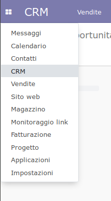
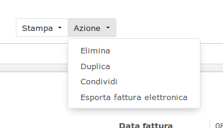
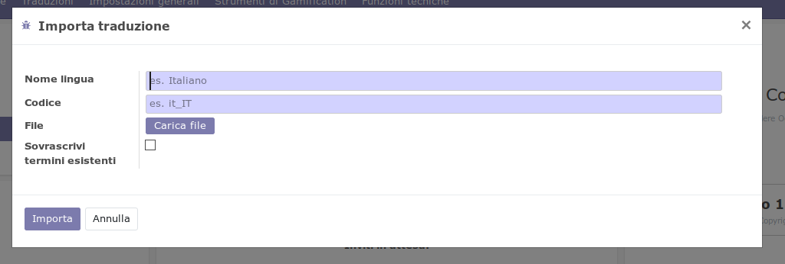
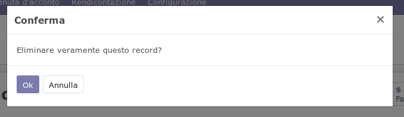
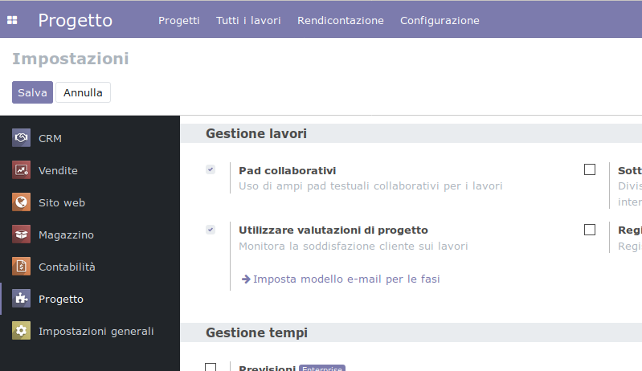

===========================
Integrazione con l'ambiente
===========================

Tipi di interazione 
===================

Gli elementi di una interfaccia utente sono strutturati in modo da adattarsi
al compito specifico che devono svolgere. Questo principio vale per tutti i
componenti dell'interfaccia con i quali l'utente si trova ad interagire.

Tali operazioni possono essere essenzialmente ricondotte a tre funzioni:

* immettere un comando
* impostare una preferenza o una proprietà
* comunicare un'informazione

================= ============================ =================================
Funzione          Traduzione                   Indicazioni ed esempi
================= ============================ =================================
*Comando*         | Imperativo presente        | L'utente ordina al programma di eseguire
                  | Seconda persona singolare  | un'operazione.
 
                                               * Pulsanti

                                               * `Voci di menù <Voci di menù_>`_
                                                 collegate ad azioni

                                               * `Finestre di dialogo <Finestre di dialogo_>`_

*Preferenza*      | Infinito presente          | Una preferenza non è legata al momento
                                               | in cui la si imposta, rimane valida
                                               | finchè l'utente non effettua una nuova
                                               | modifica.

                                               * `Impostazioni di configurazione <Impostazioni di configurazione_>`_

*Informazione*    | Dipende dal contesto,      | Quasi tutto ciò che non ricade nelle
                  | verbo indicativo presente  | precedenti categorie sono informazioni.
                  | terza persona singolare    | In generale, usare la forma impersonale.
                  | per i suggerimenti         
                                               * `Suggerimenti e aiuti <Suggerimenti e aiuti_>`_
================= ============================ =================================

Voci di menù
============

Menù applicazioni
-----------------

Le voci contenute in questo menù corrispondono ai nomi delle applicazioni installate, è sufficiente tradurre adeguatamente tali nomi.

Menù azione
-----------

Le voci di questo tipo di menù consentono all'utente di impartire un **comando**
che esegue un'azione. Seguire quindi quanto indicato alla sezione *Comando*
della `tabella <Tipi di interazione_>`_.

Finestre di dialogo
===================

Le finestre di dialogo più comuni in Odoo sono i *wizard* (procedure guidate)
che in genere vengono innescate da pulsanti o da voci di menù collegate a
una *azione*. Attraverso l'interazione con l'utente, servono a raccogliere
informazioni da usare per operazioni ed elaborazioni successive.

Dato che queste informazioni non vanno a modificare funzionalità
dell'applicazione ma servono solo per definire i dettagli dell'azione che si
vuole portare a termine, seguire quanto indicato nella sezione *Comando*
della `tabella <Tipi di interazione_>`_.

Finestre di avviso
==================

Permettono di comunicare lo stato di un'applicazione oppure richiedono
un'informazione necessaria per proseguire nel compito svolto.

A differenza degli altri tipi di finestre non sono invocate direttamente
dall'utente, inoltre richiedono l'immissione di una scelta semplice
(es. **Ok** oppure **Annulla**).

Impostazioni di configurazione
==============================

Appartengono a questa categoria le opzioni che permettono di modificare le
caratteristiche e le funzionalità di un'applicazione o degli oggetti che
ne fanno parte. Tali modifiche restano valide finchè l'utente non effettua
una nuova selezione.

Rientrano in questa tipologia le **caselle di selezione** o di scelta
multipla, escluse quelle che si trovano in una `finestra di dialogo <Finestre di dialogo_>`_.
Per la traduzione seguire quanto indicato nella sezione *Preferenza*
della `tabella <Tipi di interazione_>`_.

**Esempi**

* Dal menù principale: :menuselection:`Impostazioni --> Impostazioni generali`
  
* Dal menù di un'applicazione: :menuselection:`Configurazione --> Impostazioni`
 

* Impostazioni presenti nelle schede di una *vista modulo* (es. utente, partner, prodotto ecc.)

.. image:: immagini/integrazione06.png
   :align: center

Suggerimenti e aiuti
====================

TODO

Tour e assistenti
=================

TODO

